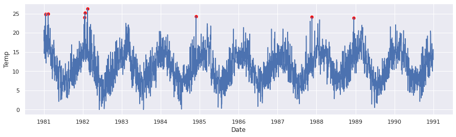

# Pyanomaly
> Módulo para detecção de anomalias.


###TODO

## Instalação

####TODO `pip install pyanomaly`

## Como usar

Iremos realizar os testes no dataset contendo temperaturas diarias da cidade de Melbourne.

dataset: https://raw.githubusercontent.com/jbrownlee/Datasets/master/daily-min-temperatures.csv

```python
import numpy as np
import pandas as pd
# plot
import matplotlib.pyplot as plt
import seaborn as sns; sns.set()
# load dataset
import io
import requests

url = "https://raw.githubusercontent.com/jbrownlee/Datasets/master/daily-min-temperatures.csv"
s = requests.get(url).content
df = pd.read_csv(io.StringIO(s.decode('utf-8')), parse_dates=['Date'])
df.set_index('Date', inplace=True)
```

```python
df.head(5).T
```


<div>
<style scoped>
    .dataframe tbody tr th:only-of-type {
        vertical-align: middle;
    }

    .dataframe tbody tr th {
        vertical-align: top;
    }

    .dataframe thead th {
        text-align: right;
    }
</style>
<table border="1" class="dataframe">
  <thead>
    <tr style="text-align: right;">
      <th>Date</th>
      <th>1981-01-01</th>
      <th>1981-01-02</th>
      <th>1981-01-03</th>
      <th>1981-01-04</th>
      <th>1981-01-05</th>
    </tr>
  </thead>
  <tbody>
    <tr>
      <th>Temp</th>
      <td>20.7</td>
      <td>17.9</td>
      <td>18.8</td>
      <td>14.6</td>
      <td>15.8</td>
    </tr>
  </tbody>
</table>
</div>


```python
#export
df.plot(figsize=(8, 4));
```


```python
mad = MAD()
mad.fit(df['Temp'])
y = mad.predict(df['Temp'])

outliers = df[y==1]
outliers.head()
```


<div>
<style scoped>
    .dataframe tbody tr th:only-of-type {
        vertical-align: middle;
    }

    .dataframe tbody tr th {
        vertical-align: top;
    }

    .dataframe thead th {
        text-align: right;
    }
</style>
<table border="1" class="dataframe">
  <thead>
    <tr style="text-align: right;">
      <th></th>
      <th>Temp</th>
    </tr>
    <tr>
      <th>Date</th>
      <th></th>
    </tr>
  </thead>
  <tbody>
    <tr>
      <th>1981-01-15</th>
      <td>25.0</td>
    </tr>
    <tr>
      <th>1981-01-18</th>
      <td>24.8</td>
    </tr>
    <tr>
      <th>1981-02-09</th>
      <td>25.0</td>
    </tr>
    <tr>
      <th>1982-01-17</th>
      <td>24.0</td>
    </tr>
    <tr>
      <th>1982-01-20</th>
      <td>25.2</td>
    </tr>
  </tbody>
</table>
</div>


```python
fig, ax = plt.subplots(1, 1, figsize=(12, 6))
                       
sns.lineplot(x=df.index, y=df['Temp'], ax=ax)
sns.scatterplot(x=outliers.index, y=outliers['Temp'], 
                color='r', ax=ax)

plt.title('Zscore Robusto', fontsize='large');
```





```python
tu = Tukey()
tu.fit(df['Temp'])
y = tu.predict(df['Temp'])

outliers = df[y==1]
outliers.head()
```


<div>
<style scoped>
    .dataframe tbody tr th:only-of-type {
        vertical-align: middle;
    }

    .dataframe tbody tr th {
        vertical-align: top;
    }

    .dataframe thead th {
        text-align: right;
    }
</style>
<table border="1" class="dataframe">
  <thead>
    <tr style="text-align: right;">
      <th></th>
      <th>Temp</th>
    </tr>
    <tr>
      <th>Date</th>
      <th></th>
    </tr>
  </thead>
  <tbody>
    <tr>
      <th>1981-01-15</th>
      <td>25.0</td>
    </tr>
    <tr>
      <th>1981-01-18</th>
      <td>24.8</td>
    </tr>
    <tr>
      <th>1981-02-09</th>
      <td>25.0</td>
    </tr>
    <tr>
      <th>1982-01-17</th>
      <td>24.0</td>
    </tr>
    <tr>
      <th>1982-01-20</th>
      <td>25.2</td>
    </tr>
  </tbody>
</table>
</div>


```python
fig, ax = plt.subplots(1, 1, figsize=(12, 6))
                       
sns.lineplot(x=df.index, y=df['Temp'], ax=ax)
sns.scatterplot(x=outliers.index, y=outliers['Temp'], 
                color='r', ax=ax)

plt.title('Tukey Method', fontsize='large');
```


