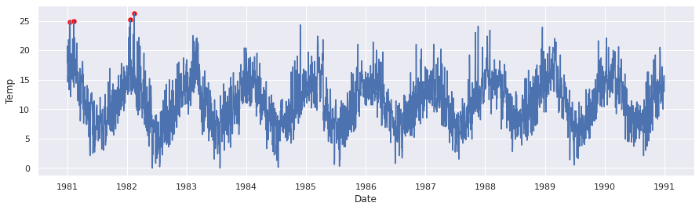

# pyanomaly
> Conjunto de algoritmos para detectar anomalias em Series Temporais.


## Instalação

pip install pyanomaly

## Como usar

Iremos realizar os testes no dataset contendo temperaturas diarias da cidade de Melbourne.

dataset: https://raw.githubusercontent.com/jbrownlee/Datasets/master/daily-min-temperatures.csv

```python
# data
import numpy as np
import pandas as pd
# plot
import matplotlib.pyplot as plt
import seaborn as sns; sns.set()

df = pd.read_csv('./dados/daily-min-temperatures.csv', parse_dates=['Date'])
df.set_index('Date', inplace=True)
```

```python
print(df.head(5).T)
```

    Date  1981-01-01  1981-01-02  1981-01-03  1981-01-04  1981-01-05
    Temp        20.7        17.9        18.8        14.6        15.8


```python
df.plot(figsize=(8, 4));
```


## Mad

```python
mad = MAD()
mad.fit(df['Temp'])
anomalies = mad.fit_predict(df['Temp'])

anomalies.head()
```


    Date
    1981-01-15    25.0
    1981-01-18    24.8
    1981-02-09    25.0
    1982-01-17    24.0
    1982-01-20    25.2
    Name: Temp, dtype: float64


```python
plot_anomalies(df['Temp'], anomalies, figsize=(15, 4));
```


## Tukey

```python
tu = Tukey()

tu.fit(df['Temp'])
anomalies = tu.predict(df['Temp'])

anomalies.head()
```


    Date
    1981-01-15    25.0
    1981-01-18    24.8
    1981-02-09    25.0
    1982-01-17    24.0
    1982-01-20    25.2
    Name: Temp, dtype: float64


```python
plot_anomalies(df['Temp'], anomalies, figsize=(15, 4));
```


## S-MAD

```python
anomalies = smad(df['Temp'], period=12)
anomalies.head()
```


    Date
    1981-01-18    24.8
    1981-02-09    25.0
    1982-01-20    25.2
    1982-02-15    26.3
    Name: Temp, dtype: float64


```python
plot_anomalies(df['Temp'], anomalies, figsize=(15, 4));
```




